# Puss-n-Boba
  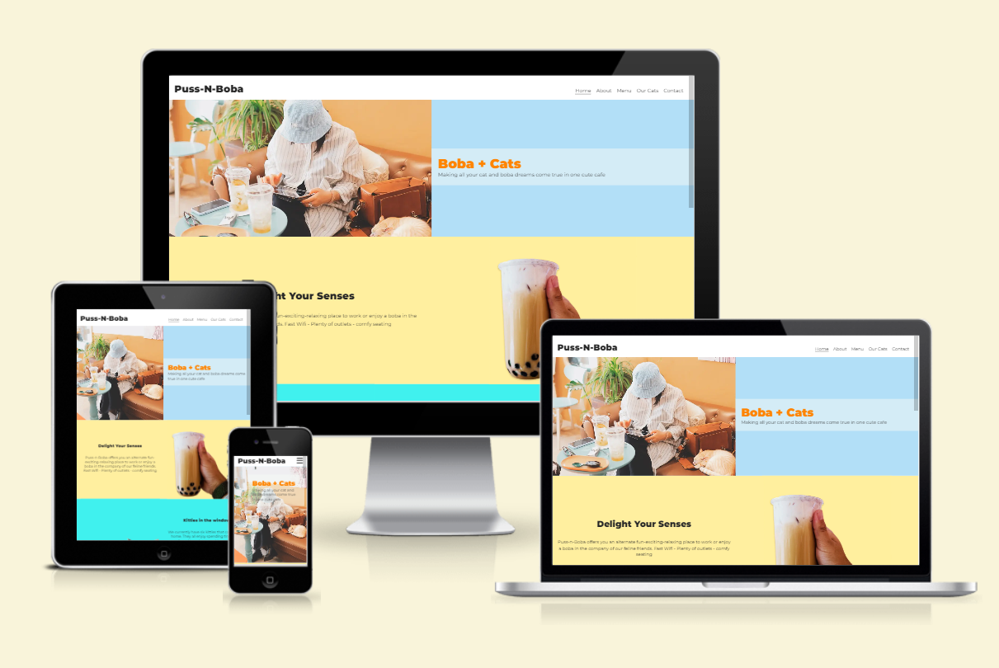

  [View Live Project Here](https://hysinh.github.io/puss-n-boba/)

## Introduction
Welcome to Puss-N-Boba, a (fictional) boba cafe who’s special feature is that we are also a cat cafe for those that love working and socialising in the presence of cats! Puss-N-Boba cafe aims to provide delicious boba and treats as well as a cat-filled environment for those relaxing or working. We provide high-speed internet, loads of power outlets, and comfy and cozy seating that works for those lounging for a relaxing chat with a friend or working away on your latest project or studies.

This website is intended to showcase the cats that call Puss-N-Boba cafe home as well as our other main feature - Boba and Treats - and the location itself as an ideal place to meet a friend or work or study. To reflect the inviting environment of the cafe, the website also features similar colours and images of the cats and the boba and treats to encourage customers to visit the cafe.

## CONTENTS  
  
* [User Experience)](#user-experience)
  * [User Stories](#user-stories) 
* [Design](#design)
  * [Site Design](#site-design)
  * [Wireframes](#wireframes)
  * [Colour Scheme](#colour)
  * [Typography](#typography)
* [Features](#features)
  * [Navigation bar](#navigation-bar)
  * [Home Page](#home-page)
  * [About Page](#about-page)
  * [Menu Page](#menu-page)
  * [Cats Page](#cats-page)
  * [Contact Form](#contact-form)
  * [Confirmation Page](#confirmation-page)
  * [Footer](#footer)  
  * [Favicon](#favicon)  
* [Future Features](#future-features)
* [Technologies](#technologies)
  * [Languages Used](#languages-used)
  * [Technologies and Programs Used](#technologies-and-programs-used)
  * [Deployment](#deployment)
* [Testing](#testing)
  * [HTML Validation](#html-validation)
  * [CSS Validationn](#css-validation)
  * [Lighthouse Performance Audits via Chrome Dev Tools](#lighthouse-performace-audit-via-chrome-dev-tools)
  * [Manual Testing](#manual-testing)
  * [Bugs and Fixes](#bugs-and-fixes)
  * [Unfixed Bugs](#unfixed-bugs)
* [Credits](#credits) 

  
---   

## User Experience
Puss-N-Boba is a boba tea cafe offers customers the very special experience of enjoying their boba tea and treats in the presence of the cafe's resident cats. The website is an essential tool to convey this special free experience that each customer can enjoy when visiting the cafe as well as reflect the aesthetic of the cafe as a fun, happy, bright cafe in which you can socialise, work, or study while enjoying your boba and cat experience. 
- ### Visitor Goal
  Puss-N-Boba visitors can range in age and gender but they all generally are animal lovers and in particular are lovers of the cat species. The website plays an essential role in providing essential information to visitors on the cat nature of the cafe, the cafe's menu and offerings, information about the cats, and how to reach Puss-n-Boba whether in person or via social media or email which includes address, telephone, opening hours, and map information.
- ### User stories
  1. User looking for the cafe can access the location information via the home page as well as along the top navbar. They can access the address information, opening hours, and a map for access information.
  2. User looking to contact the cafe can navigate to the contact page from both the home page as well as the top navbar located on each page for telephone information as well as a message contact form on the contact page. If the user prefers to contact the cafe over social media, social media icons leading to the cafe's social media are located on the footer of each page. 
  3. User looking to easily navigate the website will find links to all the essential pages on the home page as well as along the top navbar on each page. 
  4. User looking to find more information about the menu and boba offerings can easily navigate to the menu page via the home page link or from the top navbar located on each page. The menu page provides the essential menu and treats offerings.
  5. Users who prefer to find the cafe's most recent menu offerings can navigate to the cafe's social media via the social media links in the footer for the newest menu offerings.
  6. User looking to find more about cats that live at Puss-n-boba can easily navigate via a link on the home page or via the top navbar to the Cat page which provides a brief description of each cat along with a photo of the cat. It also provides some basic interaction information for users should they visit the cafe.

## Design

- #### Site design 
  Researching websites for other cafes and coffee shops, I was most drawn to the websites that had a clean and clear aesthetic. I went with a clean colour scheme and focused on the two main features of the cafe: Cats and Boba tea.

  The Puss-N-Boba website needed to be responsive and available on a variety of screen sizes and devices to make it as accessible as possible. I focused on the following sizes:

  1. Mobile Device dimensions (small): 280px x 653px
  2. Mobile Device dimensions (larger): 375px and larger
  3. Tablet Device dimensions: 736px and larger
  4. Laptop Device dimensions: 992px and larger 
- #### Wireframes
  Initially, I started by creating the initial Puss-N-Boba website wireframes with pencil and paper. After sketching out what I planned, I started laying out the HTML and basic CSS for the site in a similar way that the Love Running tutorial went.

  However, I found this process to be lacking the information and details such as the colours and fonts when using too simple a wireframe. So, part way through the process, I took my wireframes to Photoshop where I worked on the color palette, typography, and imagery in greater detail.

  

  
Mobile Wireframes
  

  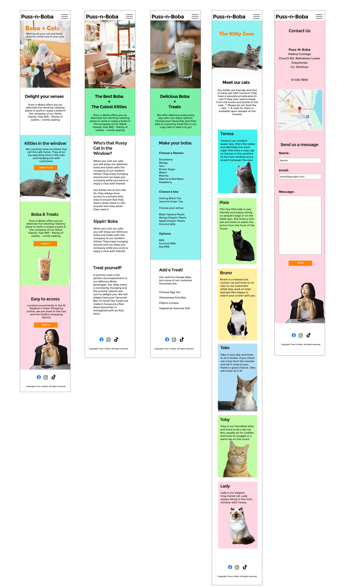
  
 

  

  
Tablet Wireframes
  

  
  
    

  

  
Desktop Wireframes
  

  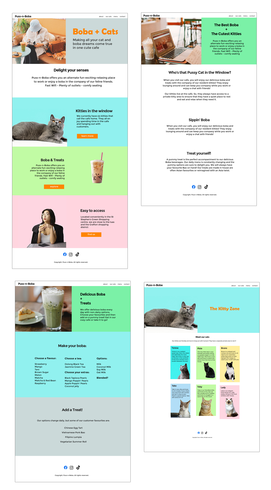
  
    
- #### Colour 
  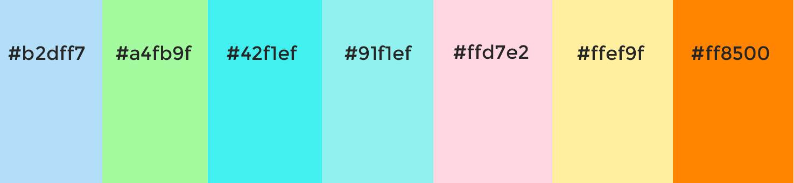
  Preferring a clean and bright aesthetic that reflected the cheeryful and pleasant interior of the cafe, the colors are designed to reflect that clean and modern aesthetic while still be fun and punchy. 
   
   
  Initially, my buttons featured white text and this, in combination with the orange background, failed the acceptable [WCAG](https://www.w3.org/WAI/WCAG21/Understanding/contrast-minimum.html) contrast ratio. Ultimately, I chose to change the text color to the same color as the rest of the website's font color to ensure readability and accessibility. I used the [Adobe Color](https://color.adobe.com/create/color-contrast-analyzer) to test the colors.

  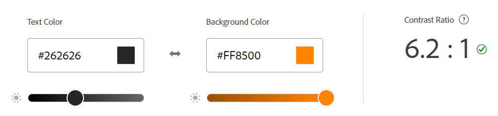
- #### Typography
  The font family is Montserrat. It was chosen for it's clean look, readability, and variety of weights.

  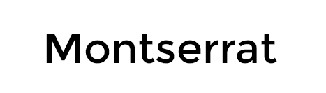

## Features
### Navigation Bar

  

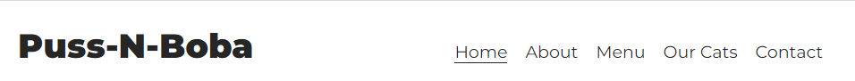

  
The Navigation Bar is featured on all five pages of the website. The full responsive navigation bar includes links to the Logo, About page, Menu Page, Our Cats page, and Contact page. Each navigation bar is identical and allows for easy navigation of the user.
 
 
The Navigation Bar allows for easy navigation from page to page across all devices. The Navigation Bar allows easy navigation without the user having to revert back to the previous page using the “back” button.

### Home Page
1. #### Hero section
   

   

   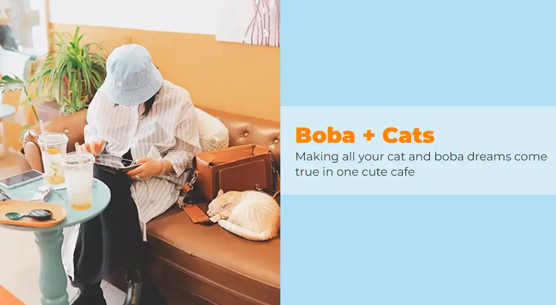
   

   The Home page features a photograph of the cafe with a customer sitting with a cat as well as enjoying a boba tea. The photograph allows the user to see exactly what the venue looks like, what the atmosphere of Puss-n-Boba is like, and what to expect when you visit Puss-N-Boba.
2. #### Cats section
   

   

   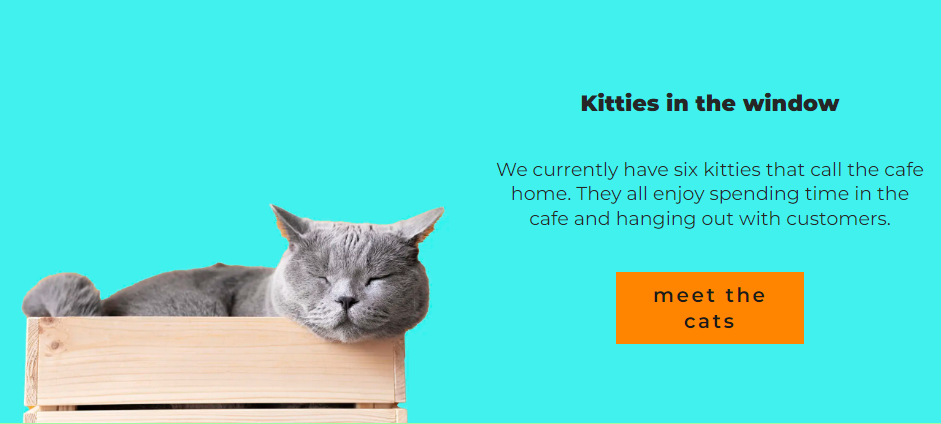
   

   The Kitties in the Window section allows the user to see the image of one of the resident cats and motivates the user to visit the cafe in hopes of interacting with the profiled cats. The “Meet the Cats” button gives the user an opportunity to navigate to the Meet the Cats page where they can view and read the profiles of each cat living at the cafe.
3. #### Boba & Treats section
   

   

   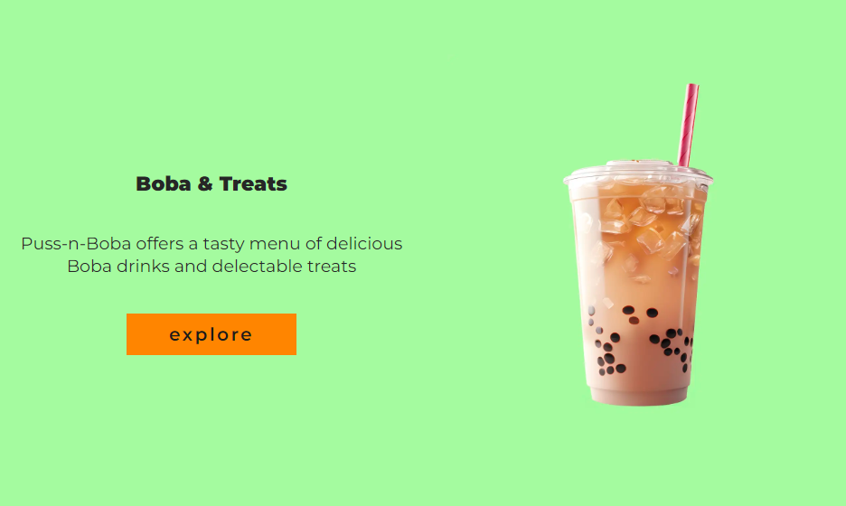
   

   The Menu section showcases the other main feature of the cafe - Boba Teas and treats. The image in this section is a boba tea so that users know exactly what is the main featured menu item of the cafe. This section features an “explore” button that directs you to the Menu page and allows the user to view the different boba and menu items at the cafe.

4. #### Contact Us section
   

   

   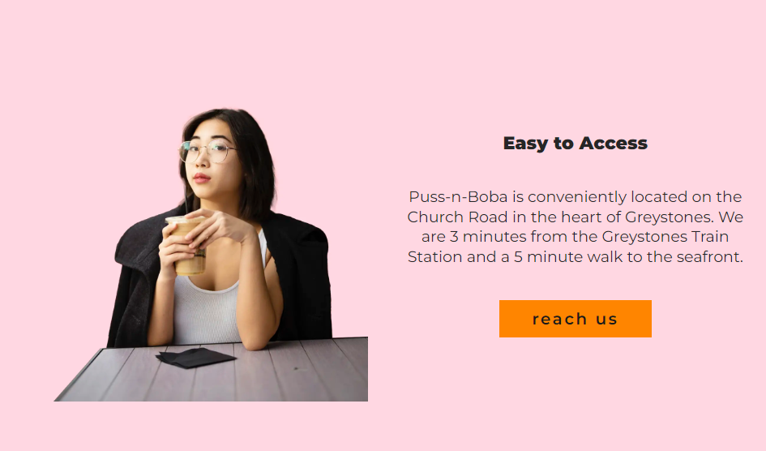
   

   The Contact section offers users an additional way to navigate to the Contact page to either find location information, contact information, or the contact form.
     
### About Page

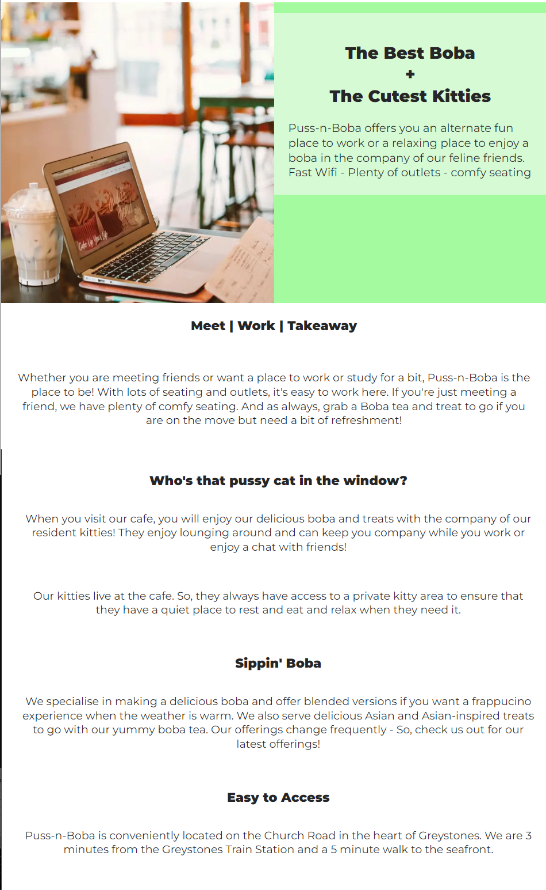

The overall design of the website continues on the About Page featuring a Hero style image at the top with overlay text highlighting the main feature of the cafe with both imagery and copy. Below the hero image, there is a summary of the main features of the cafe. The tablet and laptop layouts are similar but the mobile version switches the content to a column layout.

### Menu Page

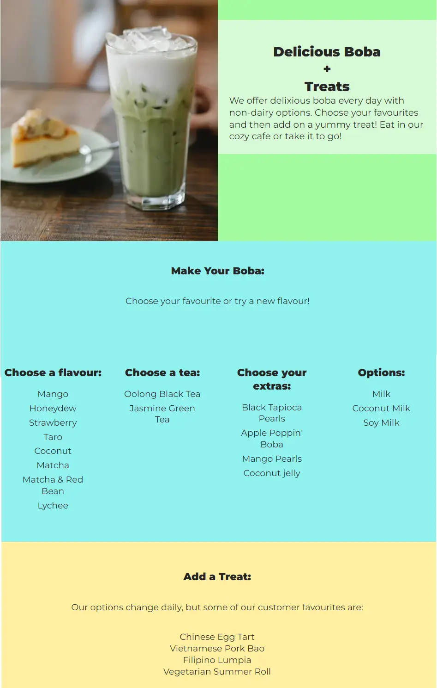

The design of the menu page follows the overall the design set by the Home page with a hero image at the top with a short amount of copy summarizing the content of the page. Below this image and copy, the page provides detail about how the boba tea menu options as well as a list of potentially available treats. Again, the tablet and laptop layouts are similar but the mobile versions switches to a column layout.

### Cats Page

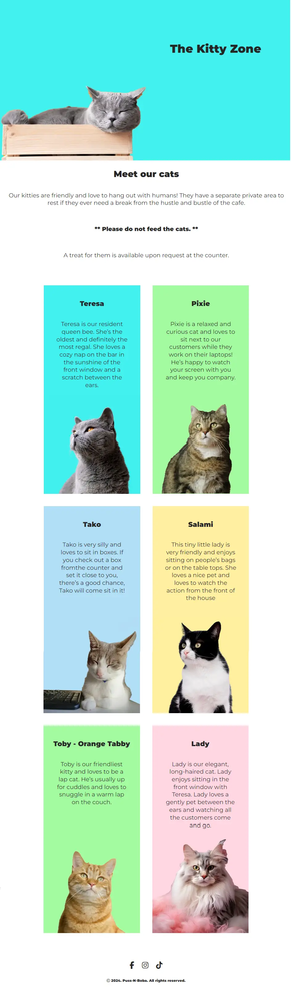

The Cats Page also follows the overall design set by the Home page with a hero image at the top with a heading describing the page. The page features a small amount of text describing the cats that live at the cafe and then feature a section of cat profiles that provide a small description of each cat along with an image of the cat. The screenshot is of the tablet layout and the cat profiles are displayed as two across. On screensizes of a laptop or larger, this cat profile layout changes to three cats across while the mobile version displays in a column layout.

### Contact Form

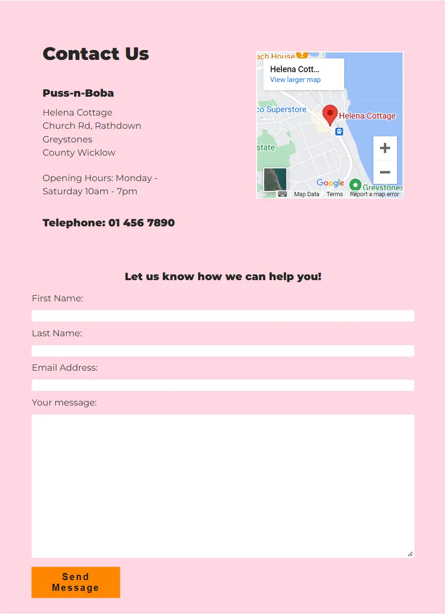

The Contact page deviates slightly from the precedence set by the other pages and omits the hero image. The page displays location and contact information for the cafe including a Google maps iframe which displays the cafe location and can provide directions if needed. The other main feature of the website is the contact form which allows the user to contact the cafe directly.

### Confirmation Page

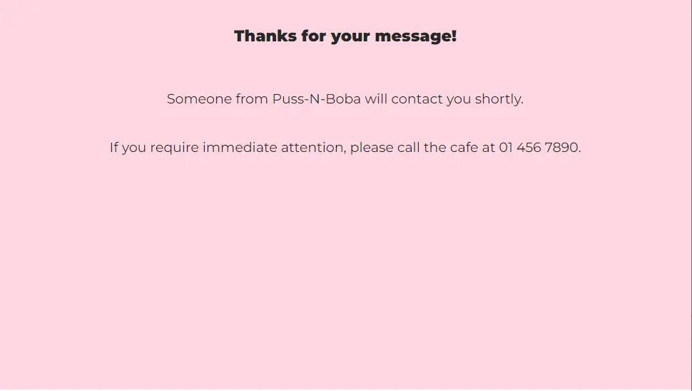

When a user completes the contact form, the user is directed to this confirmation page to let them know their form was submitted correctly and to confirmat that the cafe will contact them. The page also provides an alternate contact method (telephone) should urgency be a consideration. The page is responsive and adjusts to screensizes as appropriate. The design is remains the same across different devices.

### Footer

The footer section includes links to three relevant social media sites for Puss-n-Boba. The links open to new tabs and allow for easy navigation for the user. The footer encourages the user to interact with Puss-n-Boba in other ways and to stay connected to Puss-n-Boba on social media for the latest events, antics of the cats, and updates on featured Boba teas and treats. The design of the footer is responsive and remains consistent across mobile, tablet, and laptop device screen sizes.

### Favicon

  

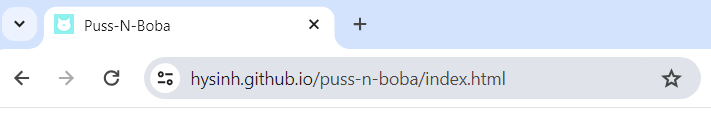

  
A favicon was added to provide further visual support of the Puss-N-Boba brand.

## Future Features
- A future feature would be a booking feature that allows people to prebook tables and timeslots for a portion of the tables to allow visitors to ensure they will have a table available should they visit the cafe.
- As an add-on to this booking feature, an inquiry form to book the cafe for special events or larger groups.
- Also for future development, a feature that allows users to pre-order Boba tea and/or treats for collection/takeaway.

## Technologies
  ### Languages Used
  - HTML5
  - CSS

  ### Technologies and Programs Used
  - GitHub - used to save and store all the files for this website
  - GitHub Codespaces - was used as the IDE to develop and test the code for this website
  - Git - provided the version control
  - Adobe Photoshop 2024 - used to create wireframes and edit all the images
  - Google Fonts - imported fonts from this website
  - Google Developer Tools - used to debug website and test for responsiveness
  - Google Lighthouse - used to audit the performance and quality of the website
  - WC3 HTML Validator - used to validate the HTML code
  - WC3 CSS Validator - used to validate the CSS code https://jigsaw.w3.org/css-validator/

  ### Deployment
  GitHub was used to deploy this website. The following steps were taken:

  1. Log into GitHub account.
  2. Navigate to the project repository: puss-n-boba
  3. Click on the Settings button on the horizontal navigation across the top portion of the page.
  4. Navigate to the Pages link under the Code and automation section on the left navigation.
  5. Under GitHub Pages, go to Build and deployment. Then, under Source, select "Deploy from a branch". 
  6. Next, under Branch, select "main" and "/root" and then click on the Save button.
  7. After a few moments, the website will be made live and the link will be made visible at the top of the page. 

  How to clone Puss-N-Boba & make changes:
  1. Open the repository on GitHub.
  2. Navigate to the CODE link on the navigation across the top.
  3. Then, navigate to the green CODE button on the right side and click.
  4. Select the Local tab and click on the copy icon to make a copy of the repository.
  5. Then navigate back to your main GitHub dashboard and then create a new repository with your desired name.
  6. On the next page, navigate to the bottom of the page and select Import code under "Import code from another repository".
  7. In the next window, paste the copied link of the Puss-N-Boba repository into the line.
  8. Then, click Begin Import to import the repository code.
  9. Make changes and/or deploy as desired.

  ## Testing

  ### Validator Testing
  - #### HTML Validation
    No errors were returned when passing the official W3C HTML Validator
    

    
Index Page HTML Validation
  

    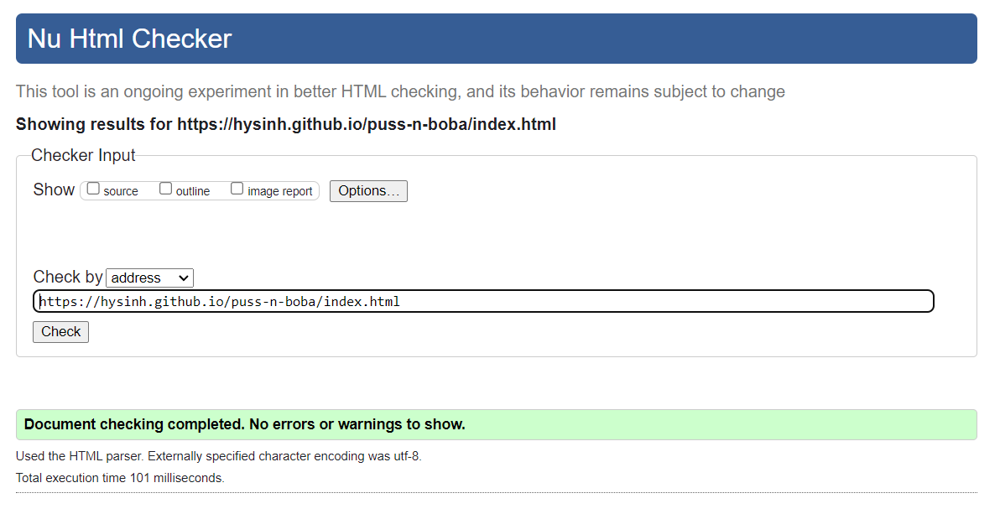
    

    

    
About Page HTML Validation
  

    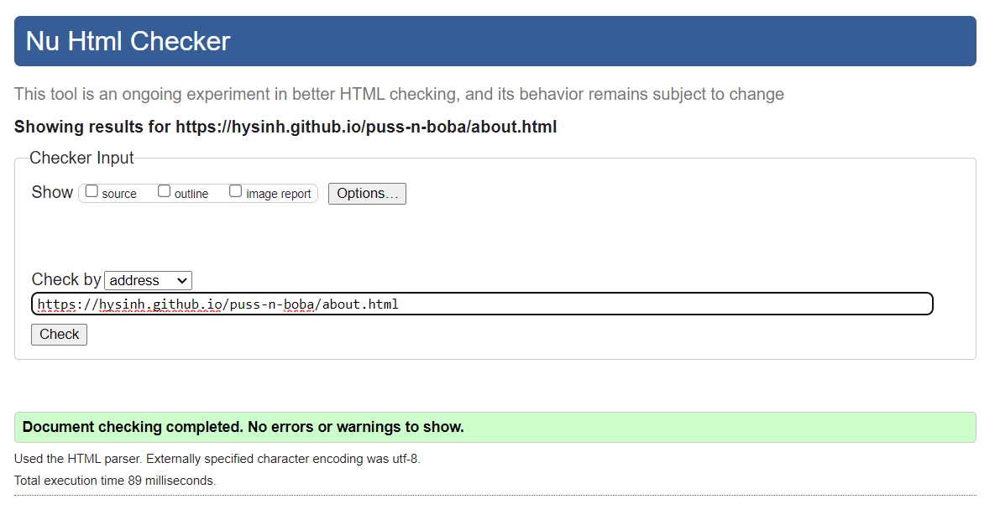
    

    

    
Menu Page HTML Validation
  

    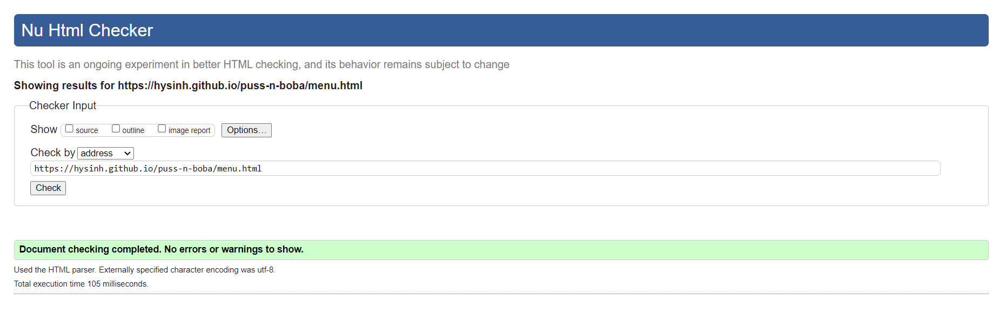
    

    

    
Meet Cats Page HTML Validation
  

    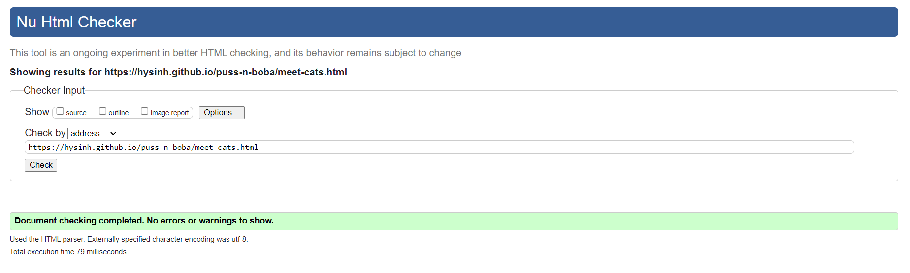
    

    

    
Contact Page HTML Validation
  

    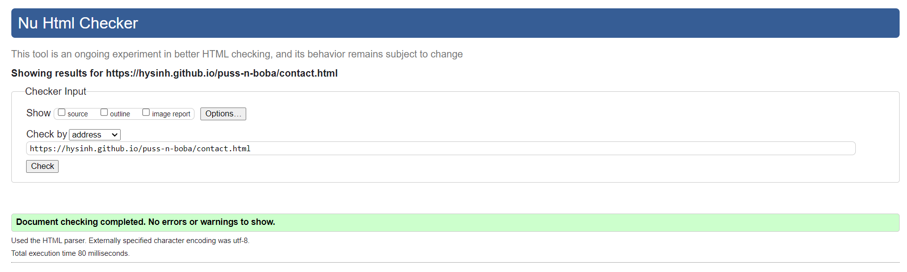
    

    

    
Confirmation Page HTML Validation
  

    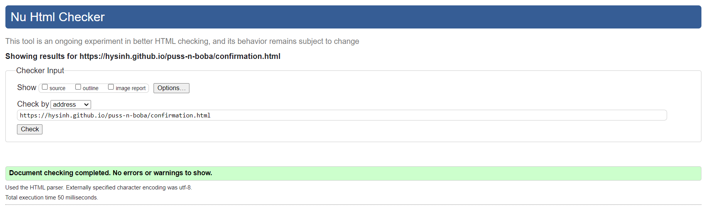
    

     
    
  - #### CSS Validation
    No errors were found when passing through the official W3C CSS Jigsaw validator
    

    
CSS Validation
  

    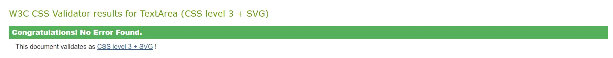
    

  - #### Lighthouse Performace Audit via Chrome Dev Tools
    Desktop Lighthouse Performance Audits
    

    
Index Page Lighthouse audit
  

    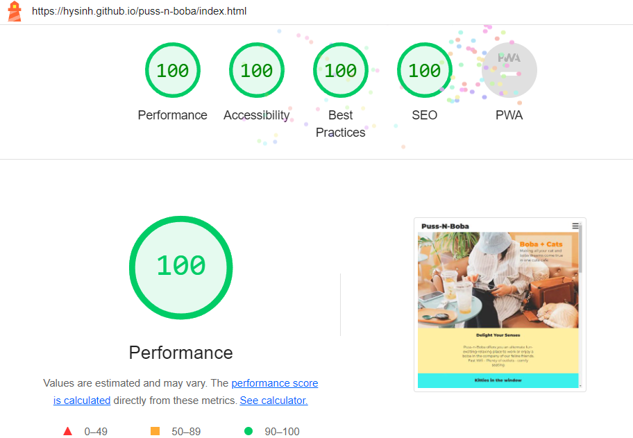
    

    

    
About Page Lighthouse audit
  

    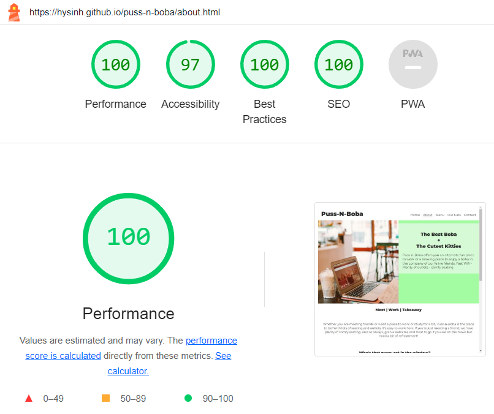
    

    

    
Menu Page Lighthouse audit
  

    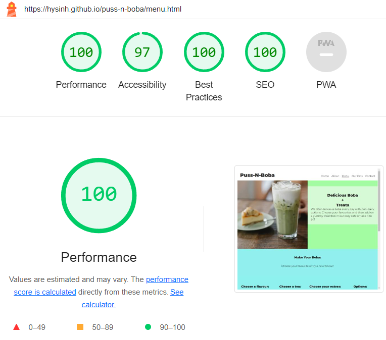
    

    

    
Cats Page Lighthouse audit
  

    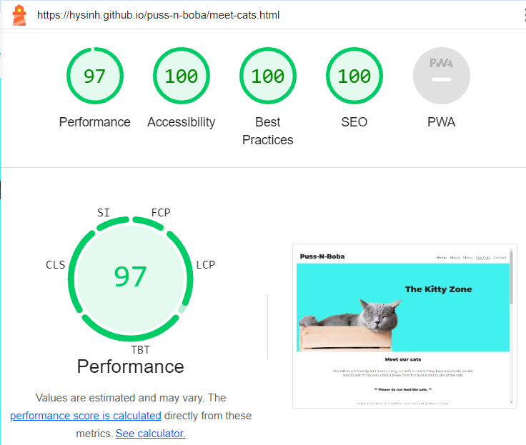
    

    

    
Contact Page Lighthouse audit: Audit revealed a Best Practices bug that I was unable to resolve. Please see table of unfixed bugs for details.
  

    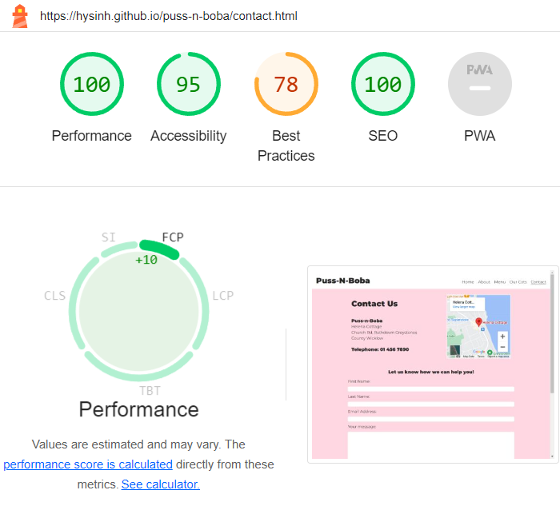
    

    

    
Contact Page Lighthouse bug
  

    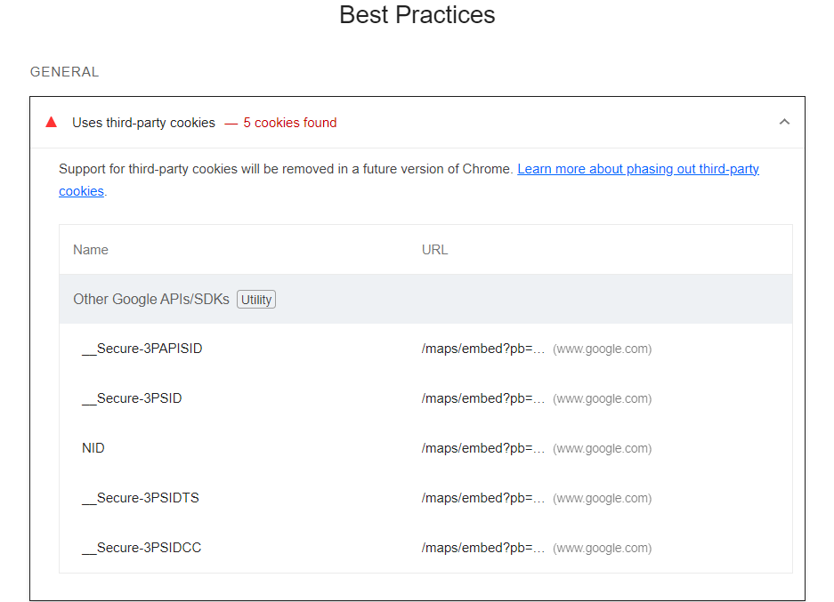
    

    

    
Confirmation Page Lighthouse audit
  

    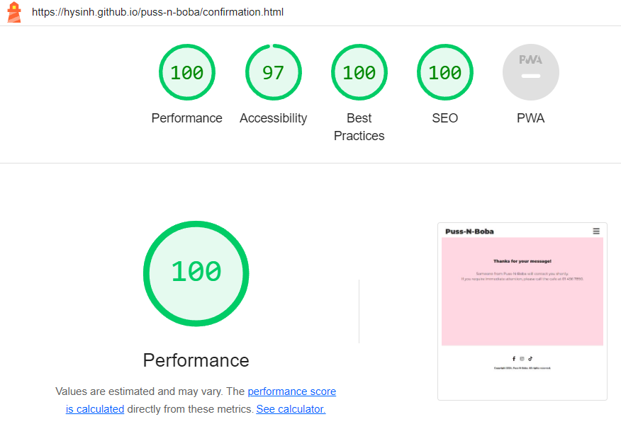
    

     

    Mobile Lighthouse Performance Audits
    

    
Index Page Lighthouse audit
  

    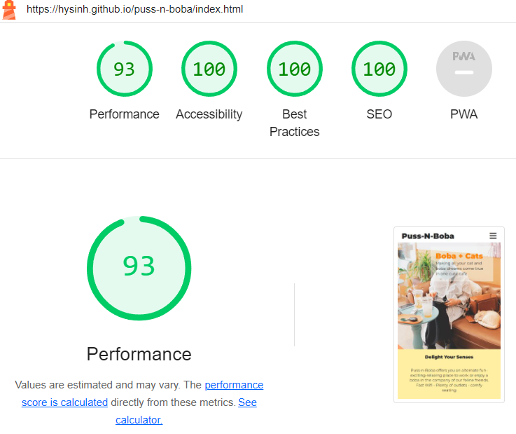
    

    

    
About Page Lighthouse audit
  

    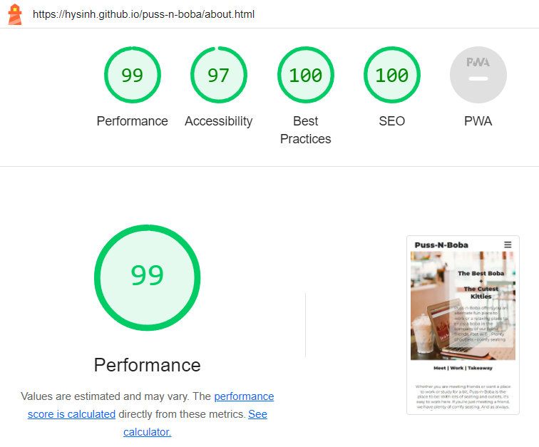
    

    

    
Menu Page Lighthouse audit
  

    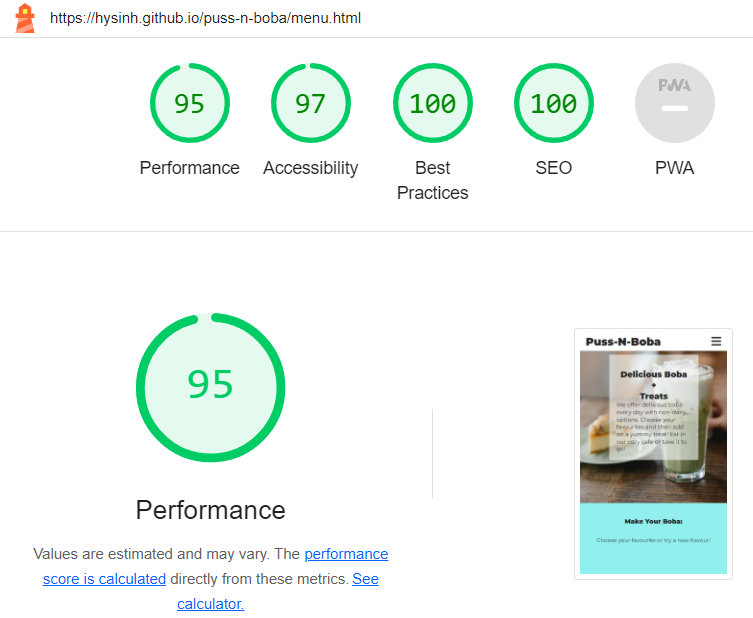
    

    

    
Cats Page Lighthouse audit
  

    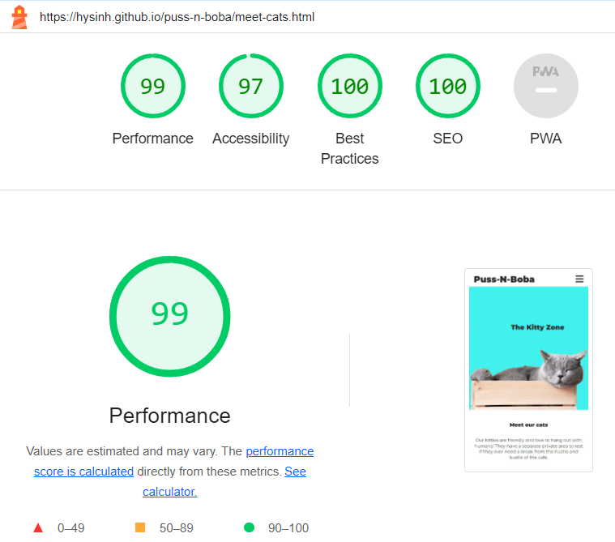
    
 
    

    
Contact Page Lighthouse audit: Audit revealed a bug that I was unable to resolve. Please see table of unfixed bugs for details.
  

    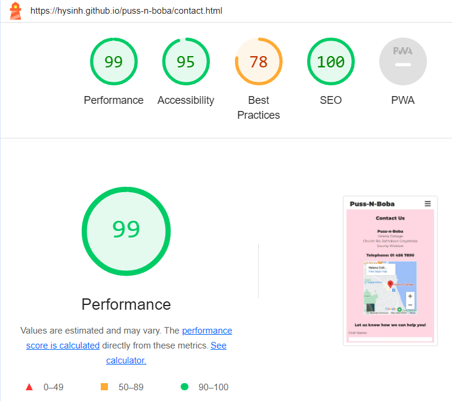
    

    

    
Confirmation Page Lighthouse audit
  

    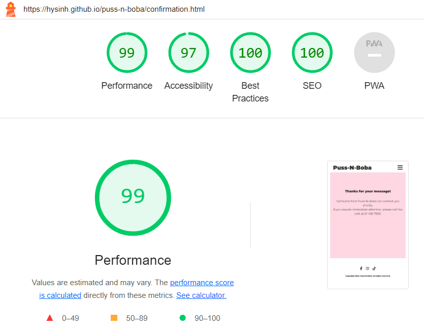
    

  ### Manual Testing
  Manual testing was performed on the website checking for broken links, content errors, and responsivity across different sizes. Testing took place during the build process using Dev Tools on Chrome and on the following real-world devices and browsers:

  #### Devices 
  1. Pixel 4XL
  2. Xiaomi 11T Pro
  3. Redmi Note 12 Pro+
  4. Lenovo IdeaPad Y500 Laptop
  5. Alienware Aurora R7 Desktop
  6. Microsoft Surface

  #### Browsers
  1. Microsoft Edge
  2. Brave
  3. Google Chrome
  4. Opera

  #### The results of testing are as follows:
  | Page | Test | Pass/Fail |
  | ---- | ---- | --------- |
  | All  | Puss-n-Boba logo links back to the homepage | Pass |
  | All  | Underline appears on hover when moving over navigation bar links | Pass |
  | All  | Underline appears on corresponding navigation link when on the page | Pass |
  | All  | Navigation links direct user correctly to the correct page | Pass |
  | All  | Footer social media icons open in a new tab and correctly bring user to the corresponding social media website | Pass |
  | All  | Images and sections are responsive to different device sizes | Pass |
  | Index  | Links on the homepage bring user to the correct page | Pass |
  | Contact | Contact form correctly requires entries into fields | Pass |
  | Contact | Contact form submission works corrrectly and brings user to a validation page | Pass |
  | Contact | Google Maps is interactive and opens in a new tab when the user clicks on "view larger map" | Pass |

  #### Bugs and Fixes
  | Bug | Page | Fix |
  | --- | ---- | --- |
  | Missing </ul> | Menu page | I had left out the close tag for my last set of unordered lists. I closed the tag and the error was resolved. |
  | Nesting a submit button inside an a element | Contact page | I had attempted to test a way to have the contact form direct the user to a confirmation page rather than the Code Institute form validator but it was not a working solution. I removed the anchor tag and the bug was resolved |
  | Div not allowed as a child of the submit button | Contact page | I had previously used a div to style the buttons on the index page. However, divs were not allowed as a child of a submit button in a form. I moved the class to the submit button classes and removed the div and this resolved the bug. |
  | Missmatching labels and ids for the contact form fields | Contact page | I had accidentally used a "-" rather than an "_" when labeling the fields for the contact form. I corrected this mistake and this resolved the bug. |
  | Color Contrast failure for accessibility on orange buttons | Index & Contact pages | After running a Lighthouse audit on Google Dev Tools, I saw that the white text on the orange buttons failed the color contrast analyzer. I adjusted the color for easier readability and accessability. |
  | Hero images are loading to slow and lowering website performance | Index, About, and Menu pages | I uploaded smaller file sized images for the mobile and tablet screen sizes. This resolved the issue. |

  ### Unfixed Bugs
  - Lower SEO Lighthouse score due to Blocking directive: x-robots-tag: noindex, nofollow. I could not find any code matching this in my website. So, I am unsure why the website sends this message to search engines. I will need to do more research to find out what is the cause for this.
  - Lighthouse audits revealed that the contact page had a Best Practices issue that involved caching of third-party cookies. Primarily, the offending feature was the google maps iframe. After researching the topic, I was unsure how to improve this on my end since it required me to be able to set the cache time to a longer period of time to allow the website to load a cached version of the map for repeat users. Since I was unable to figure out how to do this in an IDE environment, I decided that for the scope of this project, I would have to leave this bug unresolved at this time.
  - Lighthouse audits also occasionally revealed that javascript that allowed the footer icons to load from the third-party website https://fontawesome.com/ also did not always run optimally. This was not a solution I could resolve on my end without foregoing using third-party assets. To resolve this, I could have created my own icons instead of relying on a third-party site.

## Credits
### Content
- Content for website was writing by myself
- Instructions on how to implement Lighthouse Chrome Developer Tool was taken from: https://developer.chrome.com/docs/devtools/lighthouse
- Correct syntax for implementation of how to fit Background Image to a Div using CSS: https://www.geeksforgeeks.org/how-to-fit-background-image-to-div-using-css/
- W3C CSS Validator: https://jigsaw.w3.org/css-validator/
- How to Center align a div element: https://www.w3schools.com/html/html_div.asp
- HTML Block and Inline Elements: https://www.w3schools.com/html/html_blocks.asp
- How to implement and syntax for CSS background-position Property: https://www.w3schools.com/cssref/pr_background-position.php
- CSS Background Shorthand: https://www.w3schools.com/css/css_background_shorthand.asp
- CSS Box Model: https://www.w3schools.com/css/css_boxmodel.asp
- HTML Form Elements - Specifically text area properties: https://www.w3schools.com/html/html_form_elements.asp
- CSS Forms: https://www.w3schools.com/css/css_form.asp | https://www.w3schools.com/tags/tag_textarea.asp
- Tutorial on how to Style forms with CSS: https://blog.logrocket.com/how-to-style-forms-with-css-a-beginners-guide/
- How to center a div in a div vertically: https://blog.hubspot.com/website/center-div-css#:~:text=Set%20the%20top%20property%20to,(0%2C%20%2D50%25).
- A Complete Guide to Flexbox: https://css-tricks.com/snippets/css/a-guide-to-flexbox/
- Guidance for CSS Background image - Shrink to fit fixed size div: https://css-tricks.com/snippets/css/a-guide-to-flexbox/
- Guidance on how to implement and correct syntax for a background-color while also having a background image: https://stackoverflow.com/questions/8195215/css-background-image-on-background-color#:~:text=background%3A,position%20and%20background%2Drepeat%20properties.
- Correct syntax for letter-spacing property: https://developer.mozilla.org/en-US/docs/Web/CSS/letter-spacing
- How to make a cursor into a hand https://stackoverflow.com/questions/3087975/how-to-change-the-cursor-into-a-hand-when-a-user-hovers-over-a-list-item
- Ideas on how to format README.MD document: https://github.com/amylour/scoops_pp1/
- Naviation bar toggle menu code - Love running website tutorial - Code Institute

### Media
- Boba Tea Image <a href="https://www.freepik.com/free-ai-image/3d-rendering-chinese-reunion-dinner-drink_95017479.htm#fromView=search&page=1&position=0&uuid=b6560aec-2550-4e00-87e1-d1f93dd01820">Image by freepik</a>
- Girl holding boba tea drink - <a href="https://www.pexels.com/photo/young-woman-sitting-at-a-table-and-holding-a-cup-of-iced-coffee-14608213/">Pexels image by Frank Minjarez 12608213</a>
- Laptop in cafe (boba tea is AI modified) - <a href="https://www.pexels.com/photo/photo-of-laptop-beside-white-mug-1833306/">Pexels image by lisa Fotios 1833306</a>
- Boba Tea in glass with slice of cake on plate - <a href="https://www.pexels.com/photo/fresh-matcha-latte-served-on-table-with-sweet-pie-5946966/">Pexels image by Charlotte May 5946970</a>
- Girl in cafe with boba and cat (Cat and boba tea is an AI modification) <a href="https://www.pexels.com/photo/woman-using-ereader-at-cafe-12525488/">Pexels image by Tri M Nguyen 12525488</a>
- Grey cat on yellow background <a href="https://www.freepik.com/free-photo/grey-kitty-with-monochrome-wall-her_13863436.htm#fromView=search&page=1&position=20&uuid=e0b52cc4-cedf-4278-9486-ceac22348b6f">Image by freepik</a>
- Fluffy cat on purple background <a href="https://www.freepik.com/free-ai-image/beautiful-cat-with-fluffy-background_64658858.htm#query=siamese%20cat%20on%20red%20background&position=9&from_view=search&track=ais_ai_generated&uuid=0da5044d-b730-447b-82e1-69d4dfaee454">Image By freepik</a>
- Black and white cat <a href="https://www.freepik.com/free-psd/beautiful-cat-portrait-isolated_38310708.htm#query=cat&position=7&from_view=search&track=sph&uuid=dd43868f-2005-4a3b-a5e1-8f70be8520ec">Freepik</a>
- Grey cat in profile <a href="https://www.freepik.com/free-psd/beautiful-cat-portrait-isolated_38310656.htm#query=cat&position=18&from_view=search&track=sph&uuid=dd43868f-2005-4a3b-a5e1-8f70be8520ec">Freepik</a>
- Orange cat - <a href="https://www.pexels.com/photo/brown-short-coated-cat-736532/">Pexels image by Monique Laats</a>
- Tabby cat - <a href="https://www.pexels.com/photo/short-fur-black-and-brown-cat-3054570/">Pexels image</a>

