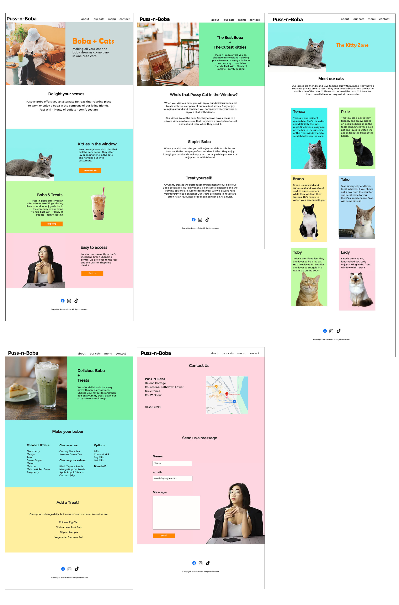

# Puss-n-Boba
  

  [View Live Project Here](https://hysinh.github.io/puss-n-boba/)

## Introduction
Welcome to Puss-N-Boba, a (fictional) boba cafe who’s special feature is that we are also a cat cafe for those that love working and socialising in the presence of cats! Puss-N-Boba cafe aims to provide delicious boba and treats as well as a cat-filled environment for those relaxing or working. We provide high-speed internet, loads of power outlets, and comfy and cozy seating that works for those lounging for a relaxing chat with a friend or working away on your latest project or studies.

I wanted this website to showcase the cats that call Puss-N-Boba cafe home as well as our other main feature - Boba and Treats - and the location itself as an ideal place to meet a friend or work or study. To reflect the inviting environment of the cafe, the website also features similar colours and images of the cats and the boba and treats to encourage customers to visit the cafe.

## CONTENTS  
  
* [User Experience)](#user-experience)
  * [User Stories](#user-stories) 
* [Design](#design)
  * [Site Design](#site-design)
  * [Colour Scheme](#colour)
  * [Typography](#typography)
  * [Wireframes](#wireframes)
* [Features](#features)
  * [Navigation bar](#navigation-bar)
  * [Home Page](#home-page)
  * [About Page](#about-page)
  * [Menu Page](#menu-page)
  * [Cat Page](#cat-page)
  * [Contact Page](#contact-page)
  * [Footer](#footer)  
* [Tablet & Mobile View](#tablet--mobile-view)
  * [Desktop, Tablet & Mobile Differences](#desktop-tablet--mobile-differences)
  * [Tablet View](#tablet-view-ipad-miniipad-prosurface-pro)
  * [Mobile View](#mobile-view-iphone-5iphone-seiphone-xriphone-12-pro)
* [Future Features](#future-features)
* [Technologies Used](#technologies-used)
  * [Languages Used](#languages-used)
  * [Frameworks, Libraries, Technologies & Programs Used](#frameworks-libraries-technologies--programs-used)
* [Deployment](#deployment)
  * [How to deploy](#how-to-deploy)
* [Testing](#testing)
  * [HTML Validation using W3C Validation](#html-validation-using-w3c-validation)
  * [CSS Validation using W3C Validation](#css-validation-using-w3c-validation)
  * [Lighthouse scores via Chrome Developer Tools](#lighthouse-scores-via-chrome-developer-tools)
  * [Bugs & Fixes](#bugs--fixes)
  * [Unsolved Bugs](#unsolved-bugs)
* [Credits](#credits) 

  
---   

## User Experience

- ### User stories
    1. User looking for cafe - map
    2. User looking for cafe location/contact information
    3. User looking to easily navigate the website
    4. User looking to find more information about the menu and boba offerings
    5. User looking to find more about cats that live at Puss-n-boba

## Design

- #### Site design 
  Researching websites for other cafes and coffee shops, I was most drawn to the websites that had a clean and clear aesthetic. I went with a clean colour scheme and focused on the two main features of the cafe: Cats and Boba tea.
- #### Colour 
  (insert image of colours scheme)
  Preferring a clean and bright aesthetic that reflected the cheeryful and pleasant interior of the care, the colors are designed to reflect that clean and modern aesthetic while still be fun and punchy.
- #### Typography
  The font family is Montserrat. It was chosen for it's clean look, readability, and variety of weights.

  
- #### Wireframes
  I started by creating the initial website wireframes with pencil and paper. After sketching out what I planned, I started laying out the HTML and basic CSS for the site in a similar way that the Love Running tutorial went.
   
  I found this to not be my design style and cumbersome. As a designer, I really needed a more solid game plan for the website and switched to Adobe Photoshop and completed the wireframes designs in Photoshop.
  

  
Mobile Wireframes
  

  
  
 

  

  
Tablet Wireframes
  

  
  
    

  

  
Desktop Wireframes
  

  
  
    

  
  

## Features
- ### Navigation Bar
  [INSERT IMAGE OF NAV BAR]
   
   
  The Navigation Bar is featured on all five pages of the website. The full responsive navigation bar includes links to the Logo, About page, Menu Page, Our Cats page, and Contact page. Each navigation bar is identical and allows for easy navigation of the user.
   
   
  The Navigation Bar allows for easy navigation from page to page across all devices. The Navigation Bar allows easy navigation without the user having to revert back to the previous page using the “back” button.

- ### Home Page
  1. #### Hero section
     The Home page features a photograph of the cafe with a customer sitting with a cat as well as enjoying a boba tea. The photograph allows the user to see exactly what the venue looks like and what the atmosphere of Puss-n-Boba is like with both the Boba tea offerings as well as the feline company.
  2. #### Cats section
     The Kitties in the Window section allows the user to see the image of a cute cat and motivates the user to visit the cafe in hopes of interacting with the profiled cats.
      
      
     The “Learn More” button gives the user an opportunity to view and read the profiles of each cat living at the cafe.
       
     The cat image encourages customers who enjoy petting and spending time with cats to visit the cafe in order to interact with the cats.
  3. #### Boba & Treats section
     This section showcases the other main feature of the cafe - Boba Teas and treats. The image in this section is a boba tea so that users know exactly what is the main featured menu item of the cafe and know what the main focus of the cafe is.
      
      
     This section features an “explore” button that directs you to the Menu page and allows the user to view the different boba and menu items at the cafe.

  4. #### Contact Us section
     this section highlights the accessibility and location of the Puss-n-Boba cafe
     
- ### About Page
  Features the Puss-n-Boba cafe offerings - brief explanation of the three main features of the cafe - cats, boba and Treats, and highlights the potential for using the cafe space for activities such as working/studying/social environment.

- ### Menu Page
  Features list of basic boba and treats offered

- ### Cats Page
  Features brief description of each cat with profile image. Creates interest in the cute resident cats for those who are cat-lovers and helps to draw cat lovers to visit the cafe for a chance to interact with the resident cats.

- ### Contact Form
  Features a way for users to send the cafe a message. The form requires the collection of the user's full name and email as well as allows a short message to be sent to the cafe.

- ### Footer
  The footer section includes links to three relevant social media sites for Puss-n-Boba. The links open to new tabs and allow for easy navigation for the user.
  The footer encourages the user to interact with Puss-n-Boba in other ways and to stay connected to Puss-n-Boba on social media for the latest events, antics of the cats, and featured Boba teas and treats.

  ## Testing

  ### Validator Testing
  - #### HTML Testing
    No errors were returned when passing the official W3C HTML Validator
    

    
Index Page HTML Validation
  

    
    

    

    
About Page HTML Validation
  

    
    

    

    
Menu Page HTML Validation
  

    
    

    

    
Meet Cats Page HTML Validation
  

    
    

    

    
Contact Page HTML Validation
  

    
    

    

    
Confirmation Page HTML Validation
  

    
    

     
    
  - #### CSS Testing
    No errors were found when passing through the official W3C CSS Jigsaw validator
    

    
CSS Validation
  

    
    

  - #### Lighthouse Performace Audit via Chrome Dev Tools
  - Desktop Lighthouse Performance Audits
      

      
Index/Landing page Lighthouse audit
  
      
      
 
      

      
About page Lighthouse audit
  
      
      
 
      

      
Menu page Lighthouse audit
  
      
      

      

      
Meet Cats page Lighthouse audit
  
      
      
 
      

      
Contact page Lighthouse audit
  
      
      
 
  - Mobile Lighthouse Performance Audits
    

    
Index Page Lighthouse audit
  

    
    

    

    
About Page Lighthouse audit
  

    
    

    

    
Menu Page Lighthouse audit
  

    
    

    

    
Cats Page Lighthouse audit
  

    
    
 
    

    
Contact Page Lighthouse audit: Audit revealed a bug that I was unable to fix. Please see table of unfixed bugs for details.
  

    
    

    
Confirmation Page Lighthouse audit
  

    
    

  - #### Manual Testing
    Manual testing was performed on the website checking for broken links, content errors, and responsivity across different sizes. Testing took place during the build process using Dev Tools on Chrome and on the following real-world devices and browsers:
     1. Microsoft Edge
     2. Brave
     3. Google Chrome
     4. Opera

     The results of testing are as follows:

     | Page | Test | Pass/Fail |
     | ---- | ---- | --------- |
     | All  | Puss-n-Boba logo links back to the homepage | Pass |
     | All  | Underline appears on hover when moving over navigation bar links | Pass |
     | All  | Underline appears on corresponding navigation link when on the page | Pass |
     | All  | Navigation links direct user correctly to the correct page | Pass |
     | All  | Footer social media icons open in a new tab and correctly bring user to the corresponding social media website | Pass |
     | All  | Images and sections are responsive to different device sizes | Pass |
     | Index  | Links on the homepage bring user to the correct page | Pass |
     | Contact | Contact form correctly requires entries into fields | Pass |
     | Contact | Contact form submission works corrrectly and brings user to a validation page | Pass |
     | Contact | Google Maps is interactive and opens in a new tab when the user clicks on "view larger map" | Pass |

  - #### Bug & Fixes
      | Bug | Page | Fix |
      | --- | ---- | --- |
      | Missing </ul> | Menu page | I had left out the close tag for my last set of unordered lists. I closed the tag and the error was resolved. |
      | Nesting a submit button inside an a element | Contact page | I had attempted to test a way to have the contact form direct the user to a confirmation page rather than the Code Institute form validator but it was not a working solution. I removed the <a> tag and the bug was resolved |
      | Div not allowed as a child of the submit button | Contact page | I had previously used a div to style the buttons on the index page. However, divs were not allowed as a child of a submit button in a form. I moved the class to the submit button classes and removed the div and this resolved the bug. |
      | Missmatching labels and ids for the contact form fields | Contact page | I had accidentally used a "-" rather than an "_" when labeling the fields for the contact form. I corrected this mistake and this resolved the bug. |
      | Color Contrast failure for accessibility on orange buttons | Index & Contact pages | After running a Lighthouse audit on Google Dev Tools, I saw that the white text on the orange buttons failed the color contrast analyzer. I adjusted the color for easier readability and accessability. |
      | Hero images are loading to slow and lowering website performance | Index, About, and Menu pages | I uploaded smaller file sized images for the mobile and tablet screen sizes. This resolved the issue. |

  - ### Unfixed Bugs
    -  Lower SEO Lighthouse score due to Blocking directive: x-robots-tag: noindex, nofollow. I could not find any code matching this in my website. So, I am unsure why the website sends this message to search engines. I will need to do more research to find out what is the cause for this.

  

  ## Deployment
   GitHub was used to deploy this website. The following steps were taken:

   1. Log into GitHub account.
   2. Navigate to the project repository: puss-n-boba
   3. Click on the Settings button on the horizontal navigation across the top portion of the page.
   4. Navigate to the Pages link under the Code and automation section on the left navigation.
   5. Under GitHub Pages, go to Build and deployment. Then, under Source, select "Deploy from a branch". 
   6. Next, under Branch, select "main" and "/root" and then click on the Save button.
   7. After a few moments, the website will be made live and the link will be made visible at the top of the page. 

  ## Credits

    - ### Technologies
      - #### Languages Used
        - HTML5
        - CSS

      - #### Technologies & Programs Used
        - GitHub - used to save and store all the files for this website
        - Git - provided the version control
        - Adobe Photoshop 2024 - used to create wireframes and edit all the images
        - Google Fonts - imported fonts from this website
        - Google Developer Tools - used to debug website and test for responsiveness
        - Google Lighthouse - used to audit the performance and quality of the website
        - WC3 HTML Validator - used to validate the HTML code
        - WC3 CSS Validator - used to validate the CSS code

  ### Content
  - The text for the entire website was writing by myself
- Instructions on how to implement Lighthouse Chrome Developer Tool was taken from: https://developer.chrome.com/docs/devtools/lighthouse
- Correct syntax for implementation of how to fit Background Image to a Div using CSS: https://www.geeksforgeeks.org/how-to-fit-background-image-to-div-using-css/
- W3C CSS Validator: https://jigsaw.w3.org/css-validator/
- How to Center align a div element: https://www.w3schools.com/html/html_div.asp
- HTML Block and Inline Elements: https://www.w3schools.com/html/html_blocks.asp
- How to implement and syntax for CSS background-position Property: https://www.w3schools.com/cssref/pr_background-position.php
- CSS Background Shorthand: https://www.w3schools.com/css/css_background_shorthand.asp
- CSS Box Model: https://www.w3schools.com/css/css_boxmodel.asp
- HTML Form Elements - Specifically text area properties: https://www.w3schools.com/html/html_form_elements.asp
- CSS Forms: https://www.w3schools.com/css/css_form.asp | https://www.w3schools.com/tags/tag_textarea.asp
- Tutorial on how to Style forms with CSS: https://blog.logrocket.com/how-to-style-forms-with-css-a-beginners-guide/
- How to center a div in a div vertically: https://blog.hubspot.com/website/center-div-css#:~:text=Set%20the%20top%20property%20to,(0%2C%20%2D50%25).
- A Complete Guide to Flexbox: https://css-tricks.com/snippets/css/a-guide-to-flexbox/
- Guidance for CSS Background image - Shrink to fit fixed size div: https://css-tricks.com/snippets/css/a-guide-to-flexbox/
- Guidance on how to implement and correct syntax for a background-color while also having a background image: https://stackoverflow.com/questions/8195215/css-background-image-on-background-color#:~:text=background%3A,position%20and%20background%2Drepeat%20properties.
- Correct syntax for letter-spacing property: https://developer.mozilla.org/en-US/docs/Web/CSS/letter-spacing
- how to make a cursor into a hand https://stackoverflow.com/questions/3087975/how-to-change-the-cursor-into-a-hand-when-a-user-hovers-over-a-list-item

### Media
- Boba Tea Image - Freepik
- Girl holding boba tea drink - Pexels - Frank Minjarez 12608213
- Laptop in cafe (boba tea is AI modified) - Pexels - lisa Fotios 1833306
- Boba Tea in glass with slice of cake on plate - Pexels - Charlotte May 5946970
- Orange tabby cat - Pexels - Monique Laats 736532
- Black cat - Pexels - Melike 13997897
- Gray cat [https://www.https://www.freepik.com/free-photo/grey-kitty-with-monochrome-wall-her_13863436.htm] Image by vwalakte</a> on Freepik] - Freepik
- Girl in cafe with boba and cat - Pexels Tri M Nguyen 12525488

